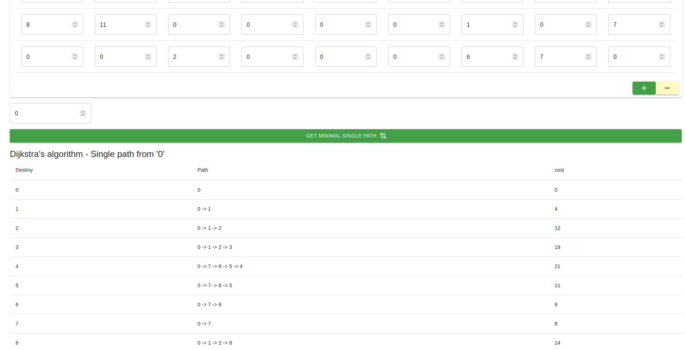

# Programa para pasar, encontrar la ruta mínima de un punto en un grafo (Español)

## Introducción
El algoritmo de Dijkstra fue propuesto por el científico de la computación Edsger W. Dijkstra en 1956. Dijkstra era un matemático y científico de la computación neerlandés conocido por sus contribuciones en el campo de la programación estructurada, la teoría de grafos y los algoritmos.

Dijkstra desarrolló el algoritmo con el objetivo de encontrar la ruta más corta entre dos nodos en un grafo ponderado. Su motivación inicial fue optimizar las rutas en la red de telecomunicaciones de los Países Bajos. El algoritmo de Dijkstra se publicó por primera vez en 1959 y se considera uno de los algoritmos fundamentales en el campo de los grafos y la teoría de redes.

## Algoritmo dijkstra

El algoritmo de Dijkstra resuelve el problema de la ruta más corta desde un único origen en un grafo dirigido y ponderado, donde cada arista tiene un peso asociado. El algoritmo utiliza una estrategia voraz (greedy) para seleccionar el siguiente nodo a visitar, actualizando continuamente las distancias más cortas conocidas a medida que explora el grafo.

El algoritmo de Dijkstra ha encontrado aplicaciones en diversos campos, como en enrutadores de red, navegación GPS, optimización de rutas en logística y planificación de vuelos, entre otros. La simplicidad y eficiencia del algoritmo lo convierten en una herramienta poderosa para resolver problemas de rutas más cortas en grafos.

La contribución de Dijkstra al campo de la informática ha sido significativa y su algoritmo continúa siendo ampliamente estudiado y utilizado en la actualidad.

En su forma más simple, utilizando una matriz de adyacencia para representar el grafo, la complejidad del algoritmo de Dijkstra es $O(V^2)$, donde V es el número de vértices en el grafo. Esto se debe a que en cada iteración del algoritmo se busca el vértice no visitado con la distancia más corta, lo cual requiere recorrer todos los vértices. Además, se realizan operaciones de actualización de distancias para cada arista adyacente al vértice seleccionado.

## Ejecución

## Acerca del autor 
Estuandite de Doctorado: Juan Carlos Moreno Sanchez

<carlos.moreno.phd@gmail.com>

<jcmorenos001@alumno.uaemex.mx>

# Program to pass, find the shortest path from one point in a graph (English)

## Introduction
Dijkstra's algorithm was proposed by computer scientist Edsger W. Dijkstra in 1956. Dijkstra was a Dutch mathematician and computer scientist known for his contributions to the field of structured programming, graph theory, and algorithms. .

Dijkstra developed the algorithm with the goal of finding the shortest path between two nodes in a weighted graph. His initial motivation was to optimize the routes in the telecommunications network of the Netherlands. Dijkstra's algorithm was first published in 1959 and is considered one of the fundamental algorithms in the field of graphs and network theory.

## dijkstra algorithm

Dijkstra's algorithm solves the problem of the shortest path from a single origin in a directed and weighted graph, where each edge has an associated weight. The algorithm uses a greedy strategy to select the next node to visit, continually updating the shortest known distances as it explores the graph.

Dijkstra's algorithm has found applications in various fields, such as network routers, GPS navigation, route optimization in logistics, and flight planning, among others. The simplicity and efficiency of the algorithm make it a powerful tool for solving graph shortest path problems.

Dijkstra's contribution to the field of computing has been significant and his algorithm continues to be widely studied and used today.

In its simplest form, using an adjacency matrix to represent the graph, the complexity of Dijkstra's algorithm is $O(V^2)$, where V is the number of vertices in the graph. This is because each iteration of the algorithm searches for the unvisited vertex with the shortest distance, which requires traversing all the vertices. In addition, distance update operations are performed for each edge adjacent to the selected vertex.

## Execution

## About the author
Student of PhD: Juan Carlos Moreno Sanchez

<carlos.moreno.phd@gmail.com>

<jcmorenos001@alumno.uaemex.mx>